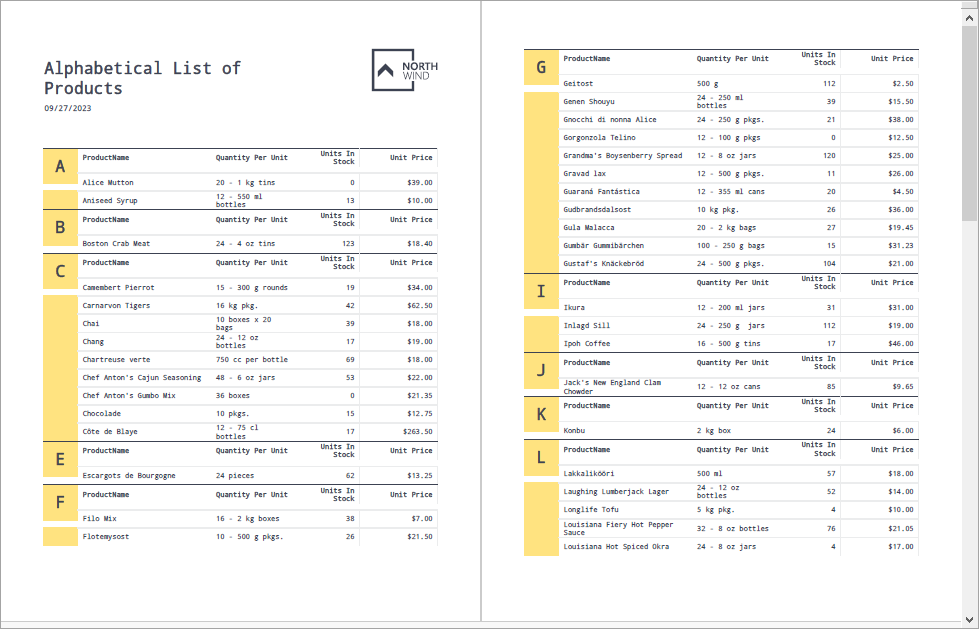
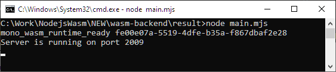
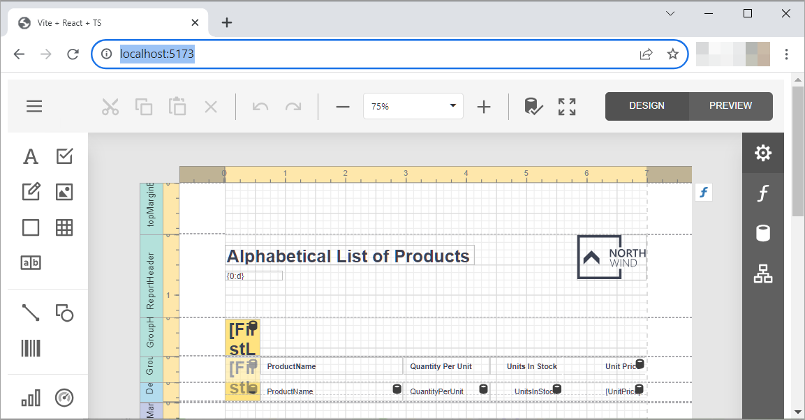

<!-- default badges list -->
[](https://supportcenter.devexpress.com/ticket/details/T1199410)
[](https://docs.devexpress.com/GeneralInformation/403183)
<!-- default badges end -->
# Reporting for Web - Create Reports Using .NET Integration with Node.js in a WebAssembly App

The two examples in this project demonstrate how to implement a Node.js backend with .NET libraries using WASM. The app allows you to load a report from a file, export the report to PDF, and invoke the End-User Report Designer to create or edit the report.

## Project 1 - WebAssembly Report Exporter

The application loads a report from a DevExpress Reports _.repx_ file, retrieves data from the JSON data source, and exports a report to PDF. 

### How to Run the Project

To run this example, navigate to the `wasm-exporter` directory, and enter the following commands in the console:

```console
dotnet build
cd result
node main.mjs
```

The result is the file named `result.pdf`. It will appear in the `result` folder.

### How the App Works

The application consists of a .NET solution that compiles into an assembly and a JavaScript solution that creates and configures the .NET runtime environment to run that assembly in Wasm.

#### .NET Solution

The .NET solution contains the following classes:

- `ReportExporter`. This class implements the `ExportToPdfAsync` method to export a report (to PDF) from JavaScript code. The method takes two `JSObject` parameters: the first holds the report model byte array and (optionally) export settings, and the second contains the resulting PDF byte array. The method instantiates a report (an [XtraReport](https://docs.devexpress.com/XtraReports/DevExpress.XtraReports.UI.XtraReport) descendant), adds the `JsonSourceCustomizationService` service, and converts JavaScript export options to a . NET object. To initiate the export operation, simply call the `ExportToPdfAsync` method of the report object model.
- `JsonSourceCustomizationService`. This example uses a JSON data source, and the report model can contain a JSON URI. Since WebAssembly prohibits HTTP requests, this service is needed to replace the [JsonDataSource.JsonSource](https://docs.devexpress.com/CoreLibraries/DevExpress.DataAccess.Json.JsonDataSource.JsonSource) value with a purposefully constructed object.
- `SimplifiedUriJsonSource`. A [UriJsonSource](https://docs.devexpress.com/CoreLibraries/DevExpress.DataAccess.Json.UriJsonSource) descendant that proxies the HTTP request to the JS portion of the application.

#### JavaScript Implementation

The JavaScript implementation creates and configures the .NET runtime that runs in Wasm. 

Let's take a closer look at some of the JavaScript code.

```
setModuleImports('main.mjs', { getJsonData });
``` 
The `setModuleImports` method imports the `getJsonData()` method into Wasm, and makes it accessible from .NET code. The `getJsonData()` method is declared in the same file. The method downloads the JSON file using the specified URL.

The following code obtains all methods exported from the .NET application implementation that is already compiled to Wasm:
```
const exports = await getAssemblyExports(config.mainAssemblyName);
```
This example calls the `ExportToPdfAsync` method that is selected from the list of exported methods. The following must be done to prepare the arguments for the method:

- read the file that contains the report model
- specify export options
- create an empty object to which the result should be saved.

Once arguments are ready, a call to the `ExportToPdfAsync` method results in a PDF file that is saved using the `writeFileSync` Node.js function. The resulting file appears as follows:



### Files to Review

- [Program.cs](wasm-exporter/Program.cs)
- [main.mjs](wasm-exporter/main.mjs)


## Project 2 - End-User Report Designer

### How to Run the Project

To run this example, you should start the back-end app, the front-end app, and open the front-end app in a browser.

#### Start the Back-End App

Navigate to the `wasm-backend` directory, and enter the following commands in the console:

```console
npm i
dotnet build
cd result
node main.mjs
```

The server starts:



#### Start the FrontEnd App

Navigate to the `frontend` directory, and enter the following commands in the console:

```console
npm i
npm run dev
```

The frontend server starts:


#### Open the FronEnd URL in a Browser



### How the App Works

The application consists of a .NET implementation that compiles into an assembly, and a JavaScript implementation.

#### JavaScript Implementation

The JavaScript implementation is an express.js server that has several endpoints for the Designer, Viewer and Query Builder components. 

In this example, multiple methods are imported from the JS implementation into WebAssembly: 

```js
    dataSource: {
        getJsonData: {...}
    },
    reportStorage: {
        getData: (url) => {...},
        setData: (buf, url) => {...},
        setNewData: (buf, url) => {...},
        getUrls: () => {...}

    },
    dataConnectionStorage: {
        getJsonDataConnections: () => {...}
    }

```
The methods do the following:

- `dataSource.getJsonData`. Gets JSON data for the data source.

- `reportStorage.*`. Perform report model file operations: create, update, read and list models.

- `dataConnectionStorage.getJsonDataConnections`. Retrieves a collection of predefined data sources for the Report Designer.

Server handlers use the following methods exported from WebAssembly:

- `Init`. Initializes backend internal services.

- `GetReportDesignerModel`. Retrieves the Designer model for the client.

- `ProcessViewerRequestAsync`. Processes requests from the Preview component of the Report Designer.

- `ProcessDesignerRequestAsync`. Encapsulates Report Designer logic.

- `ProcessQueryBuilderRequestAsync`. The Query Builder component uses this method. When Report Designer adds a data source, the method gets the data source schema.

#### .NET Implementation

The .NET implementation is composed of `Program.cs` and `Services.cs` files. 

The `Services.cs` file contains custom implementations of services necessary for Report Designer operation. Services are registered in a dependency injection container. 

The `Program.cs` file contains the `WasmAdapter` class that exports all available APIs. The `Init` method fills the DI container with services. The `GetReportDesignerModel` method customizes the Designer. Other methods use built-in services to handle client requests.

Custom services do the following:

- `ReportStorage` class handles report model operations and proxies requests for report lists, to create, read, and modify a report. In this example, the JS app implementation handles file operations in a file repository.
- `CustomJsonDataConnectionProviderFactory` and  `WebDocumentViewerJsonDataConnectionProvider` classes retrieve data by connection names stored in the reports. In this example, the JS app implementation handles a collection of predefined connections. 
- `CustomDataSourceWizardJsonDataConnectionStorage` class retrieves predefined connections for the Data Source Wizard in a JS Report Designer.
- `SimplifiedUriJsonSource` class is used to get data by URL for the JSON datasource if the connection string contains an URL.

#### Files to Review

- [main.mjs](wasm-backend/main.mjs)
- [Program.cs](wasm-backend/Program.cs)
- [Services.cs](wasm-backend/Services.cs)

## Documentation

- [Get Started with DevExpress Reporting](https://docs.devexpress.com/XtraReports/14651/get-started-with-devexpress-reporting)
- [Print and Export in React Application](https://docs.devexpress.com/XtraReports/401843/web-reporting/javascript-reporting/react/print-and-export)
- [Web End-User Report Designer](https://docs.devexpress.com/XtraReports/119176/web-reporting/web-end-user-report-designer)
- [Report Designer Server-Side Configuration (ASP.NET Core)](https://docs.devexpress.com/XtraReports/400196/web-reporting/javascript-reporting/server-side-configuration/report-designer/report-designer-server-side-configuration-asp-net-core)
- [Reporting — Create a Vite-Powered Web App](https://community.devexpress.com/blogs/reporting/archive/2022/08/02/reporting-create-a-vite-powered-web-app.aspx)
- [Run .NET from JavaScript](https://learn.microsoft.com/en-us/aspnet/core/client-side/dotnet-interop?view=aspnetcore-7.0)


## More Examples

- [Reporting for Blazor WASM - Get Started and Create an Application Using Microsoft Template](https://github.com/DevExpress-Examples/reporting-blazor-wasm-get-started)
- [Blazor WASM Reporting (JavaScript-Based) - UI Customization](https://github.com/DevExpress-Examples/reporting-blazor-wasm-customization)